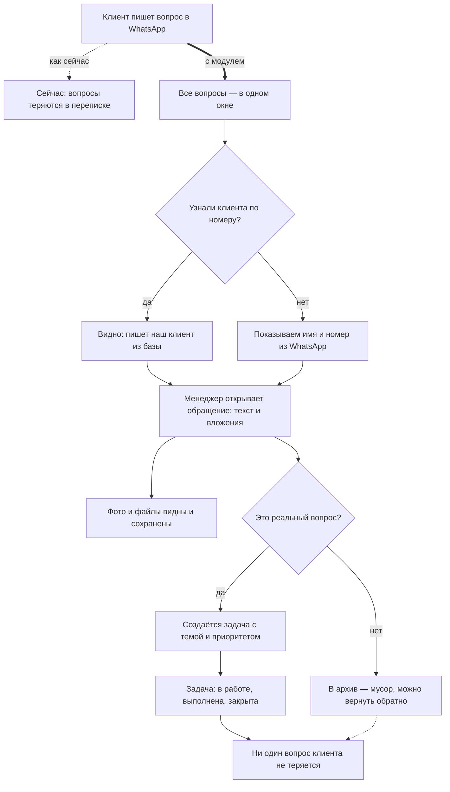

# Вопросы с WhatsApp — как это работает для бизнеса

Сегодня клиенты пишут вопросы по 1С в WhatsApp на рабочие номера — и часть сообщений теряется. Модуль собирает все обращения в одно окно, и ни один вопрос не пропадает.

**Главное для директора:**

- Все вопросы клиентов из WhatsApp — в одном рабочем окне, а не в личных переписках.
- Система сама узнаёт клиента по номеру телефона; если номера нет в базе — видно имя и номер из WhatsApp.
- Фото и файлы из переписки сохраняются и доступны прямо в обращении.
- Менеджер одним действием превращает вопрос в задачу или отправляет мусор в архив (ошибочное можно вернуть).
- Каждая задача доводится до закрытия — виден статус по любому обращению.
